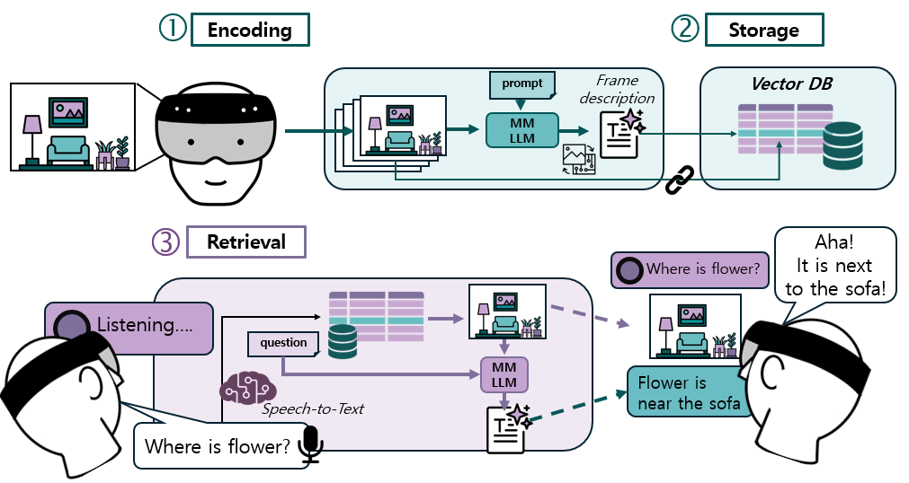
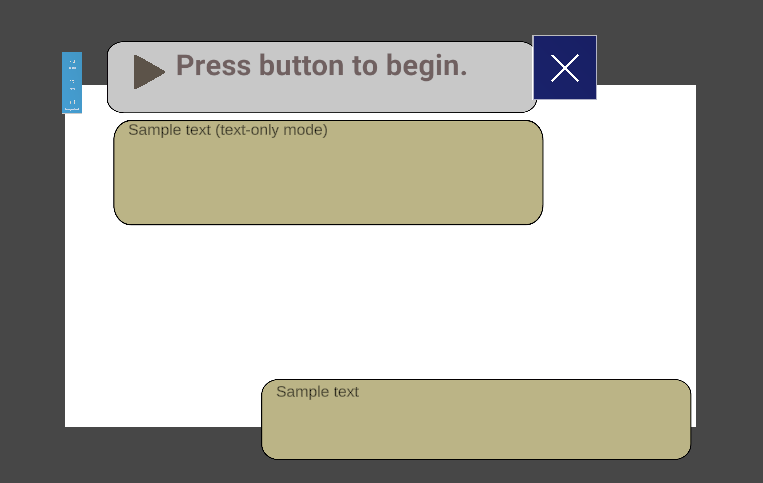

# ARMemory
Memories retrieval using Multimodal LLM with Hololens 2.

This syetem developed for deployment on Hololens 2 device 

1) Captures images from user's field of view and stores the descriptions of them generated with LLM in a vector database;

2) Retrieves the images best matching the user's question and generates textual answers complementing the retrieved images.



## Table of Contents
- [Server set-up](#servers)
- [Encoding](#encoding)
    - [Server](#e-server)
    - [Client](#e-server)
- [Retrieval](#retrieval)
    - [Server](#r-server)
    - [Client](#r-server)

## Server set-up

1. Clone the repository; to run the server, you will only need files in the *server* folder.

```git clone https://github.com/bess-cater/ARMemory.git && cd ARMemory/server```

2. Build docker image from dockerfile:

```docker build -t memory_image .```

3. And run it:

```docker run -i -t -d --name memory --ipc=host --gpus all -v "$(pwd)/ARMemory/server:/memory" -p 9999:9999 memory_image```

4. Activate conda environment:

```conda env create -f environment.yml && conda activate memory```

Additional steps:

1. For *Image* and *Image+Text* mode you may want to use segmentation model. We use [LISA](https://github.com/dvlab-research/LISA/tree/main).

Clone the repository and place the corresponding folder **inside** the *server* folder.

You may want to change the port; in this case, make sure to assign the same port in server and client-related files.

## Encoding 

This section describes the process for capturing pictures from Hololens built-in camera and processing them with the chosen LLM.

### Server

1. Before starting the server, make sure to provide your OpenAI key if you are using GPT-4o model or/and OpenAI model for vector embeddings;
it is required [here](https://github.com/bess-cater/ARMemory/blob/411f2611bddf089c9fab526e12047ae922e90ac6/server/myserver.py#L167).

2. Start the server

```python -m myserver --save <name of a person whose viewpoint is recorded> --scene <place which is recorded>```

### Client

In order to enable Hololens 2 capturing images and sending it to the server, you need to build the Hololens application from Unity project.

1. Open [**encoding** scene](https://github.com/bess-cater/ARMemory/blob/09007dda99f5df36fecb546ef34f9f129e746d1f/client/Assets/encoding.unity)

2. Make sure that [encoding script](https://github.com/bess-cater/ARMemory/blob/09007dda99f5df36fecb546ef34f9f129e746d1f/client/Assets/myscipts/HololensSender.cs) is attached to the scene and your IP and port are [set](https://github.com/bess-cater/ARMemory/blob/09007dda99f5df36fecb546ef34f9f129e746d1f/client/Assets/myscipts/HololensSender.cs#L21).

3. Before building the application, make sure your app has access to the WebCam (Edit - Project Settings - Capabilities - WebCam)

4. Build and deploy solution

5. Run in the Hololens 2 device (grant access to the WebCam)

## Retrieval

In this stage, answers to the users' questions are retrieved with the help of LLM.

### Server 

1. Run [send_message.py](https://github.com/bess-cater/ARMemory/blob/f78a0cc03d5d60fe30c17de5d33ab57b0dde0744/server/send_message.py)

``` python -m send_message --save <name of a person whose viewpoint is recorded> --scene <place which is recorded> --condition <condition> ```

The first two arguments must be the same as in the Encoding stage; for condition, you may choose *image*, *text*, ot *image_text*.

### Client

1. Create a new project in Unity and make sure you have configured it with the [Mixed Reality Toolkit](https://learn.microsoft.com/en-us/training/modules/mixed-reality-toolkit-project-unity/). We used [version 2.8.3.0](https://github.com/microsoft/MixedRealityToolkit-Unity/releases/).

2. For this project, we especially rely on Microsoft Azure cognitive services; the package must be downloaded from [here](https://learn.microsoft.com/en-us/training/modules/azure-speech-services-tutorials-mrtk/3-exercise-integrate-speech-recognition-transcription) and imported into the Unity project.

3. Open the [retrieval scene](https://github.com/bess-cater/ARMemory/blob/f78a0cc03d5d60fe30c17de5d33ab57b0dde0744/client/scenes/retrieval.unity). If everything is set right, you will see the following layout:



4. To use the sevices, provide your Speech SDK credentials.

5. Do not forget to [set your IP and port](https://github.com/bess-cater/ARMemory/blob/09007dda99f5df36fecb546ef34f9f129e746d1f/client/Assets/myscipts/SocketClient.cs#L42)!

6. Before the build, make sure that **InternetClient**, **Microphone**, and **SpatialPerception** capabilities of the Publishing settings are enabled.

7. Build and deploy solution; run it on the Hololens 2.


